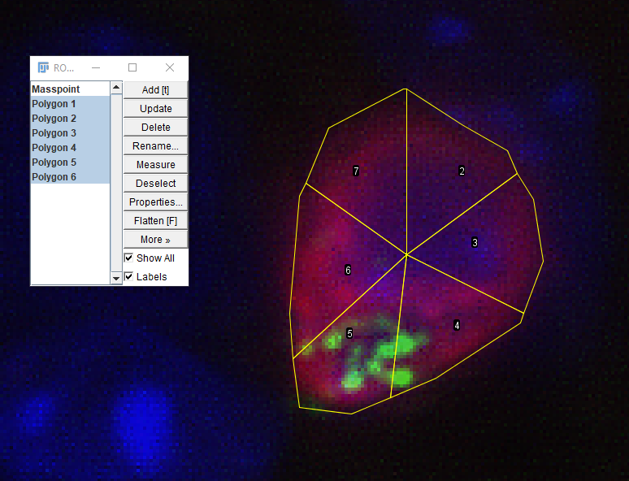

# Vesicle quantification

This application is an imageJ macro that quantifies the distribution of certain vesicles in different parts of the cells to be able to make a statement as to 
whether the vesicles are approximately equally distributed or whether polarization occurs.

The background of this application is a request in the [imageJ forum](https://forum.image.sc/t/quantification-of-the-distribution-of-vesicles-in-different-sections-of-a-cell-fluorescence-intensity/34300). 

## Usage

1. Open the image (image with the cell(s)) in imageJ and import this macro. 

2. Draw a polygon around the cell and press F2 after the polygon is finished. **IMPORTANT: The drawing-direction of the polygon has to be clockwise!**

## License
 
 MIT
